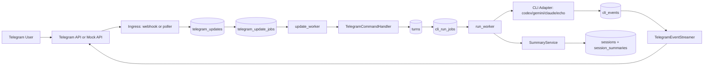

# coreline_bots_dashboard

[](https://www.python.org/)
[](https://fastapi.tiangolo.com/)
[](https://www.postgresql.org/)
[](./tests)

Telegram <-> CLI adapter bridge MVP.

- Telegram update ingestion (webhook + polling)
- Job queue + lease/retry orchestration on PostgreSQL
- CLI provider execution (`codex`, `gemini`, `claude`, `echo`)
- Real-time event streaming back to Telegram
- Multi-bot supervisor and local mock messenger for full offline testing

---

## Table of Contents

- [특징](#특징)
- [1. Project Summary](#1-project-summary)
- [2. Architecture](#2-architecture)
- [3. Runtime Modes](#3-runtime-modes)
- [4. Tech Stack](#4-tech-stack)
- [5. Quick Start](#5-quick-start)
- [6. Configuration](#6-configuration)
- [7. Run Guide](#7-run-guide)
- [8. Mock Messenger Guide](#8-mock-messenger-guide)
- [9. Telegram Command Reference](#9-telegram-command-reference)
- [10. API Endpoints](#10-api-endpoints)
- [11. Data Model and Queue States](#11-data-model-and-queue-states)
- [12. Metrics and Observability](#12-metrics-and-observability)
- [13. Test Strategy](#13-test-strategy)
- [14. Script Catalog](#14-script-catalog)
- [15. Troubleshooting](#15-troubleshooting)
- [16. License](#16-license)

---

## 특징

- 각 봇은 기본적으로 `/mode` 명령을 통해 `gemini`, `codex`, `claude` 모드를 자유롭게 전환할 수 있습니다.
- 멀티봇을 지원하여, 한 번의 프롬프트로 여러 봇에서 다양한 형태의 결과물을 병렬로 얻을 수 있습니다.
- 멀티봇은 동적으로 다수 생성 및 삭제가 가능합니다.
- 대시보드를 제공하여 시뮬레이션과 다양한 추가 개발 테스트를 수행할 수 있습니다.
- Telegram 연동 코드는 구현되어 있으나, 현재 Telegram 계정 부재로 실계정 연동 테스트는 아직 진행하지 않았습니다.

---

## 1. Project Summary

이 프로젝트는 Telegram 메시지를 CLI 에이전트 실행으로 연결하는 브리지입니다.
핵심은 다음 4단계입니다.

1. Telegram 업데이트 수신 (webhook/polling)
2. DB 기반 큐에 작업 적재
3. 워커가 CLI provider 실행 + 이벤트/아티팩트 수집
4. 결과를 Telegram으로 스트리밍 전송 + 세션 요약 누적

현재 구조는 MVP이지만, 멀티봇/장애복구/로컬 테스트 자동화까지 포함되어 운영 검증에 유리합니다.

---

## 2. Architecture



### 핵심 동작 포인트

- **Lease 기반 워커 처리**
  - `telegram_update_jobs`, `cli_run_jobs`를 `FOR UPDATE SKIP LOCKED`로 lease 처리
  - 워커 재시작/크래시 시 lease 만료 후 재처리 가능
- **중복 제어**
  - `(bot_id, update_id)` 중복 차단
  - 활성 run/session 유니크 인덱스로 동시성 보호
- **세션 연속성**
  - provider thread id 저장 + rolling summary 누적
  - provider 전환 시 thread는 reset, summary 기반 문맥은 유지
- **실시간 스트리밍**
  - 이벤트를 `cli_events`에 영속화
  - Telegram 메시지 edit + continuation 전략으로 장문 대응

---

## 3. Runtime Modes

### `embedded`

- 봇당 1프로세스
- 각 프로세스가 API + workers를 같이 수행
- 엔드포인트: `/healthz`, `/readyz`, `/metrics`, `/telegram/webhook/{bot_id}/{path_secret}`

### `gateway`

- 공유 webhook API 1개 + gateway bot마다 worker-only 프로세스
- API/worker 분리 운영에 유리
- gateway API는 모든 gateway bot webhook을 수신해서 큐에 적재

---

## 4. Tech Stack

- Python 3.11+
- FastAPI + Uvicorn
- SQLAlchemy 2 + asyncpg
- PostgreSQL (운영 큐/상태 저장소)
- httpx (Telegram API / 외부 요청)
- PyYAML + pydantic-settings
- pytest + pytest-asyncio
- Playwright (mock UI E2E)

---

## 5. Quick Start

### macOS / Linux

```bash
docker compose up -d postgres

python3 -m venv .venv
source .venv/bin/activate
pip install -e ".[dev]"

cp .env.example .env
cp config/bots.example.yaml config/bots.yaml
```

### Windows (PowerShell)

```powershell
.\scripts\bootstrap-local.ps1
```

### 최소 실행

```bash
python -m telegram_bot_new.main supervisor
```

---

## 6. Configuration

### 6.1 `.env` 주요 변수

| Key | Required | Default | Description |
|---|---|---|---|
| `DATABASE_URL` | Yes | - | PostgreSQL async URL |
| `LOG_LEVEL` | No | `INFO` | 로그 레벨 |
| `JOB_LEASE_MS` | No | `30000` | 잡 lease 기간 |
| `WORKER_POLL_INTERVAL_MS` | No | `250` | 워커 poll 주기 |
| `SUPERVISOR_RESTART_MAX_BACKOFF_SEC` | No | `30` | supervisor 재시작 백오프 상한 |
| `TELEGRAM_API_BASE_URL` | No | `https://api.telegram.org` | Telegram base URL (mock 사용 시 로컬 주소) |
| `TELEGRAM_VIRTUAL_TOKEN` | No | `mock_token_1` | mock 토큰 자동 fallback |
| `TELEGRAM_BOT_TOKEN` | No | empty | env-only bootstrap 토큰 |
| `TELEGRAM_OWNER_USER_ID` | No | empty | owner-only 접근 제어 |
| `TELEGRAM_BOT_ID` | No | `bot-1` | env-only bootstrap bot id |
| `TELEGRAM_BOT_NAME` | No | `Bot 1` | env-only bootstrap bot name |
| `TELEGRAM_BOT_MODE` | No | `embedded` | env-only bootstrap mode |
| `TELEGRAM_WEBHOOK_PUBLIC_URL` | No | empty | webhook URL (없으면 polling) |
| `TELEGRAM_WEBHOOK_PATH_SECRET` | No | empty | webhook path secret |
| `TELEGRAM_WEBHOOK_SECRET_TOKEN` | No | empty | webhook secret token |

### 6.2 `config/bots.yaml`

최소 설정:

```yaml
bots:
  - telegram_token: TELEGRAM_BOT_TOKEN
```

상세 설정 예시:

```yaml
bots:
  - bot_id: bot-a
    name: Bot A
    mode: embedded
    telegram_token: "123456:abc"
    owner_user_id: 111111111
    adapter: gemini
    webhook:
      path_secret: bot-a-path
      secret_token: bot-a-secret
      public_url: https://example.com/telegram/webhook/bot-a/bot-a-path
    codex:
      model: gpt-5
      sandbox: workspace-write
    gemini:
      model: gemini-2.5-pro
    claude:
      model: claude-sonnet-4-5
```

### 6.3 Token fallback 규칙

- `telegram_token: TELEGRAM_BOT_TOKEN`이면 `.env`의 `TELEGRAM_BOT_TOKEN` 대체
- 토큰이 비어 있고 `TELEGRAM_API_BASE_URL`이 로컬 mock 주소면 `TELEGRAM_VIRTUAL_TOKEN` 자동 사용
- `owner_user_id`가 비어 있으면 누구나 접근 가능

---

## 7. Run Guide

### 7.1 Python module CLI

```bash
python -m telegram_bot_new.main supervisor
python -m telegram_bot_new.main run-bot --bot-id bot-1
python -m telegram_bot_new.main run-gateway --config config/bots.yaml --host 0.0.0.0 --port 4312
```

### 7.2 Console scripts

```bash
telegram-bot-new supervisor
telegram-bot-new-mock --host 127.0.0.1 --port 9082
```

### 7.3 Windows helper

```powershell
.\scripts\run-local.ps1 -Mode supervisor
.\scripts\run-local.ps1 -Mode run-bot -BotId bot-1
.\scripts\run-local.ps1 -Mode run-gateway
```

---

## 8. Mock Messenger Guide

로컬에서 Telegram 없이 전체 플로우를 검증하는 핵심 구성입니다.

### 8.1 Single-bot fixed stack (macOS/Linux)

```bash
./scripts/run-local.sh up
```

관리 명령:

```bash
./scripts/run-local.sh start
./scripts/run-local.sh stop
./scripts/run-local.sh restart
./scripts/run-local.sh status
./scripts/run-local.sh logs
./scripts/run-local.sh doctor
```

기본 URL:

- UI: `http://127.0.0.1:9082/_mock/ui?token=mock_token_1&chat_id=1001&user_id=9001`
- Bot health: `http://127.0.0.1:8600/healthz`

### 8.2 Multi-bot stack

```bash
./scripts/run-local-multibot.sh start
```

기본 동작:

- 기본 config: `config/bots.multibot.yaml`
- 기본 `MAX_BOTS=8` (소스 config가 더 커도 효과 설정은 기본 8개)
- mock + supervisor 동시 기동

유용한 명령:

```bash
./scripts/run-local-multibot.sh status
./scripts/run-local-multibot.sh logs
./scripts/run-local-multibot.sh stop
MAX_BOTS=3 ./scripts/run-local-multibot.sh start
CONFIG_PATH=config/bots.yaml ./scripts/run-local-multibot.sh start
```

### 8.3 Windows mock scripts

```powershell
.\scripts\run-mock-messenger.ps1
.\scripts\run-local-with-mock.ps1 -Config config/bots.yaml
.\scripts\run-mock-codex-bridge.ps1
.\scripts\stop-mock-codex-bridge.ps1
```

---

## 9. Telegram Command Reference

| Command | Description |
|---|---|
| `/start` | 웰컴/사용 가이드 메시지 |
| `/help` | 명령어 요약 |
| `/new` | 새 세션 생성 |
| `/status` | 현재 bot/adapter/model/session/thread/summary 상태 |
| `/reset` | 현재 세션 리셋 후 새 세션 |
| `/summary` | rolling summary 출력 |
| `/mode` | 현재 provider 확인 + 사용법 안내 |
| `/mode <codex\|gemini\|claude>` | provider 전환 (활성 run 중이면 차단) |
| `/providers` | provider binary 설치여부 + 기본 model 표시 |
| `/stop` | 활성 run 취소 요청 |
| `/youtube <query>` / `/yt <query>` | YouTube 검색 후 watch URL 전송 |
| `/echo <text>` | 입력 텍스트 그대로 에코 |

일반 텍스트를 보내면 run queue에 turn이 적재됩니다.

추가 동작:

- 인라인 callback 버튼(`요약`, `다시생성`, `다음추천`, `중단`)
- action token TTL 기본 24시간
- YouTube 자연어 의도(한/영, 오타 변형 일부) 처리

---

## 10. API Endpoints

### 10.1 Runtime API (embedded / gateway)

| Method | Path | Description |
|---|---|---|
| `GET` | `/healthz` | liveness |
| `GET` | `/readyz` | readiness |
| `GET` | `/metrics` | runtime + queue counters |
| `POST` | `/telegram/webhook/{bot_id}/{path_secret}` | Telegram webhook ingest |

### 10.2 Mock Telegram-compatible API

| Method | Path |
|---|---|
| `POST` | `/bot{token}/getUpdates` |
| `POST` | `/bot{token}/setWebhook` |
| `POST` | `/bot{token}/deleteWebhook` |
| `POST` | `/bot{token}/sendMessage` |
| `POST` | `/bot{token}/editMessageText` |
| `POST` | `/bot{token}/answerCallbackQuery` |
| `POST` | `/bot{token}/sendDocument` |
| `POST` | `/bot{token}/sendPhoto` |

### 10.3 Mock Test/UI API

| Method | Path | Description |
|---|---|---|
| `GET` | `/_mock/ui` | 웹 UI |
| `GET` | `/_mock/threads` | 스레드 목록 |
| `POST` | `/_mock/send` | 유저 메시지 주입 |
| `GET` | `/_mock/messages` | 메시지 타임라인 조회 |
| `POST` | `/_mock/messages/clear` | 타임라인/업데이트 정리 |
| `GET` | `/_mock/document/{document_id}` | 문서/이미지 다운로드 |
| `GET` | `/_mock/state` | mock 내부 상태 |
| `GET` | `/_mock/bot_catalog` | 봇 카탈로그 |
| `POST` | `/_mock/bot_catalog/add` | 동적 bot 추가 |
| `POST` | `/_mock/bot_catalog/delete` | bot 삭제 |
| `GET` | `/_mock/bot_diagnostics` | bot 진단(health/metrics/session/error_tag) |
| `POST` | `/_mock/rate_limit` | 429 시뮬레이션 룰 |

---

## 11. Data Model and Queue States

### 핵심 테이블

- `bots`
- `telegram_updates`
- `telegram_update_jobs`
- `sessions`
- `turns`
- `cli_run_jobs`
- `cli_events`
- `session_summaries`
- `action_tokens`
- `deferred_button_actions`
- `runtime_metric_counters`

### 큐 상태값

- `telegram_update_jobs`: `queued`, `leased`, `completed`, `failed`
- `cli_run_jobs`: `queued`, `leased`, `in_flight`, `completed`, `failed`, `cancelled`
- `turns`: `queued`, `in_flight`, `completed`, `failed`, `cancelled`
- `sessions`: `active`, `reset`

### 동시성/무결성 포인트

- 활성 run 유니크 인덱스: `uq_cli_run_jobs_bot_chat_active`
- 활성 session 유니크 인덱스: `uq_sessions_bot_chat_active`
- 이벤트 순서 유니크: `(turn_id, seq)` in `cli_events`
- DB schema + SQL migrations는 런타임 시작 시 자동 적용

---

## 12. Metrics and Observability

`GET /metrics` 응답 구조:

- `telegram_update_jobs`
- `cli_run_jobs`
- `in_flight_runs`
- `telegram_updates_total`
- `telegram_update_jobs_by_status`
- `cli_run_jobs_by_status`
- `runtime_counters`

`runtime_counters` 대표 키:

- `webhook_accept_total`
- `webhook_duplicate_update`
- `webhook_reject_*`
- `callback_ack_success`
- `callback_ack_failed`
- `telegram_rate_limit_retry_total`
- `telegram_rate_limit_retry.<method>`
- `worker_heartbeat.run_worker`
- `worker_heartbeat.update_worker`
- `provider_switch_total.<provider>`
- `provider_run_failed.<provider>`

---

## 13. Test Strategy

### 13.1 Unit/Integration (pytest)

```bash
pytest
```

주요 커버리지:

- settings/token fallback 로직
- adapter 명령 생성 + 이벤트 정규화
- telegram API parsing/poller
- command 핸들러(owner check, mode 전환, callback action token)
- run worker artifact 전달(image/html)
- queue/repository 동시성 유틸
- mock messenger API/webhook/polling/diagnostics
- supervisor 프로세스 스펙 계산

### 13.2 E2E (Playwright)

```bash
./scripts/verify-mock-ui-e2e.sh
```

검증 포인트:

- 멀티봇 사이드바/레이아웃
- slash command suggestion
- 병렬 전송 결과 수집
- profile 추가/삭제 흐름

### 13.3 Smoke scripts

```bash
./scripts/verify-multibot-smoke.sh
./scripts/verify-release-flow.sh
```

---

## 14. Script Catalog

| Script | Purpose |
|---|---|
| `scripts/bootstrap-local.ps1` | Windows bootstrap(venv + deps + config seed) |
| `scripts/run-local.ps1` | Windows runtime helper(supervisor/run-bot/run-gateway) |
| `scripts/run-local.sh` | macOS/Linux single-bot stack wrapper |
| `scripts/run-local-fixed.sh` | single-bot stack 실제 실행기(mock + bot) |
| `scripts/run-local-multibot.sh` | multi-bot stack 실행기(mock + supervisor) |
| `scripts/run-local-with-mock.ps1` | Windows에서 mock + supervisor 동시 실행 |
| `scripts/run-mock-messenger.ps1` | Windows mock만 실행 |
| `scripts/run-mock-codex-bridge.ps1` | mock + codex bridge 실행 |
| `scripts/stop-mock-codex-bridge.ps1` | bridge/mock 정리 |
| `scripts/verify-multibot-smoke.sh` | 멀티봇 스모크 검증 |
| `scripts/verify-mock-ui-e2e.sh` | mock UI Playwright E2E |
| `scripts/verify-release-flow.sh` | 주요 테스트 + 런타임 스모크 |

---

## 15. Troubleshooting

### `provider executable not found` 에러

- `codex`, `gemini`, `claude` CLI 설치 확인
- `/providers`로 설치 상태 확인
- 설치된 provider로 `/mode <codex|gemini|claude>` 전환

### run이 이미 활성 상태라 enqueue 실패

- 메시지: `A run is already active...`
- `/stop` 실행 후 재시도
- active run 보호 인덱스가 의도적으로 중복 실행을 차단

### mock에서 update가 안 들어오는 경우

- webhook 모드에서는 `getUpdates`가 기본 차단됨
- 필요 시 mock 실행 시 `--allow-get-updates-with-webhook` 사용
- 또는 polling 모드로 전환

### 포트 충돌

- single-bot 기본: `9082`(mock), `8600`(bot)
- multi-bot 기본: `9082`(mock), `8600+`(embedded bots), `4312`(gateway)
- `status`/`doctor` 명령으로 상태 확인

### 로컬 mock 재시작 후 polling offset 꼬임

- 로컬 mock base URL(`127.0.0.1`/`localhost`)일 때는 ingest state reset 로직이 동작해 offset 문제를 줄입니다.

---

## 16. License

This project is licensed under the MIT License.
See [LICENSE](./LICENSE).

---

## Reference Paths

- Entrypoint: `src/telegram_bot_new/main.py`
- Supervisor: `src/telegram_bot_new/supervisor.py`
- Embedded runtime: `src/telegram_bot_new/runtime_embedded.py`
- Gateway runtime: `src/telegram_bot_new/runtime_gateway.py`
- Workers: `src/telegram_bot_new/workers/`
- Adapters: `src/telegram_bot_new/adapters/`
- Repository/DB: `src/telegram_bot_new/db/`
- Mock messenger: `src/telegram_bot_new/mock_messenger/`
- Tests: `tests/`
