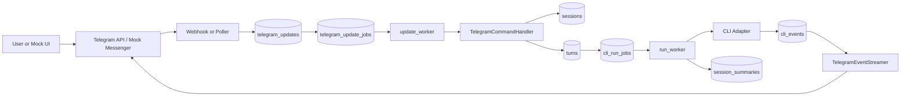

# Coreline Bots Dashboard

Telegram 메시지를 CLI 기반 AI 에이전트(Codex, Gemini, Claude) 실행으로 연결하는 멀티봇 브리지 프로젝트입니다. 단일 봇 응답기 수준이 아니라, `ingress -> DB queue -> worker -> provider adapter -> event streaming` 흐름과 로컬 Mock Messenger UI까지 포함한 운영형 MVP로 구현되어 있습니다.

## 프로젝트 분석 요약

이 저장소는 크게 네 가지 축으로 구성됩니다.

1. `Telegram ingress`
   실제 Telegram webhook/polling 또는 로컬 Mock Messenger에서 업데이트를 받습니다.
2. `Session + queue persistence`
   세션, turn, 작업 큐, 이벤트, 요약, 감사 로그를 DB에 저장합니다.
3. `CLI provider execution`
   `codex`, `gemini`, `claude` CLI를 subprocess로 실행하고 JSON stream을 표준 이벤트로 정규화합니다.
4. `Local orchestration UI`
   Mock Messenger 웹 UI에서 멀티봇, debate, cowork, play command를 실험할 수 있습니다.

현재 코드 기준으로 보면 이 프로젝트의 핵심 강점은 다음과 같습니다.

- 어댑터 교체 비용이 낮습니다. Provider별 CLI 차이를 `adapters/`에서 흡수합니다.
- Telegram 수신과 실제 실행을 DB 큐로 분리해 재시도와 lease 기반 복구가 가능합니다.
- 로컬 개발 환경이 강합니다. Mock Messenger, 멀티봇 실행 스크립트, Playwright E2E까지 함께 있습니다.
- 세션 상태에 `adapter`, `model`, `skill`, `project_root`, `unsafe_until`, `thread_id`, `rolling_summary`를 유지해 작업 연속성을 고려했습니다.

반대로 현재 구조에서 주의할 점도 분명합니다.

- 외부 CLI 설치와 인증 상태에 강하게 의존합니다.
- `mock_messenger/cowork.py`와 `mock_messenger/web/app.js`에 기능이 많이 집중되어 있어 변경 영향 범위가 큽니다.
- 운영 DB는 PostgreSQL을 기준으로 설계되었지만, 로컬 멀티봇 편의상 SQLite도 함께 지원합니다. 문맥에 따라 DB 동작 차이를 이해해야 합니다.

## 실제 구현 범위

### 백엔드 런타임

- `python -m telegram_bot_new.main supervisor`
  봇 설정 파일을 읽어 embedded bot 프로세스와 gateway 프로세스를 감시합니다.
- `python -m telegram_bot_new.main run-bot --bot-id <id>`
  개별 봇을 실행합니다.
- `python -m telegram_bot_new.main run-gateway`
  gateway 모드 봇들의 webhook ingress를 한 프로세스로 받습니다.

### Provider adapter

현재 어댑터는 아래 4종입니다.

- `codex`
- `gemini`
- `claude`
- `echo`

`codex`, `gemini`, `claude`는 모두 CLI subprocess를 실행하고 스트리밍 JSON 이벤트를 내부 공통 이벤트로 변환합니다. `run_worker`는 이 이벤트를 DB에 적재하고 Telegram edit/send 스트리밍으로 전달합니다.

### 세션 및 명령 체계

텔레그램 명령 처리기는 아래 상태를 세션에 반영합니다.

- `/new`, `/reset`, `/status`, `/summary`
- `/mode`, `/model`
- `/project`
- `/skills`, `/skill`
- `/unsafe`
- `/providers`
- `/stop`
- `/youtube`

즉, 이 프로젝트는 단순 챗봇이 아니라 "대화 세션에 실행 환경을 붙이는 컨트롤 레이어"에 가깝습니다.

### Mock Messenger / 멀티봇 오케스트레이션

Mock Messenger는 Telegram 대체 입력 채널이자 개발용 제어 UI입니다.

- `/talk`, `/relay`, `/pitchbattle`, `/quizbattle`
- `/debate-lite`, `/improv`, `/quest`, `/memechain`, `/court`
- `/cowork` 기반 역할 분담 오케스트레이션
- 봇 카탈로그 조회/추가/삭제
- embedded runtime health/metrics diagnostics
- artifact 다운로드 및 HTML/이미지 preview

## 아키텍처


```mermaid
flowchart LR
    U[User or Mock UI] --> TG[Telegram API / Mock Messenger]
    TG --> IN[Webhook or Poller]
    IN --> TU[(telegram_updates)]
    TU --> TUJ[(telegram_update_jobs)]
    TUJ --> UW[update_worker]
    UW --> CMD[TelegramCommandHandler]
    CMD --> S[(sessions)]
    CMD --> T[(turns)]
    T --> RJ[(cli_run_jobs)]
    RJ --> RW[run_worker]
    RW --> AD[CLI Adapter]
    AD --> EV[(cli_events)]
    RW --> SS[(session_summaries)]
    EV --> ST[TelegramEventStreamer]
    ST --> TG
```

### 요청 처리 흐름

1. webhook 또는 polling이 update를 수신합니다.
2. update payload를 `telegram_updates`에 저장합니다.
3. `telegram_update_jobs` 큐에 적재합니다.
4. `update_worker`가 명령/일반 텍스트를 해석합니다.
5. 세션을 생성 또는 재사용하고 `turns`, `cli_run_jobs`를 만듭니다.
6. `run_worker`가 provider CLI를 실행합니다.
7. provider stream을 `cli_events`에 적재합니다.
8. 이벤트를 Telegram edit/send 방식으로 스트리밍합니다.
9. turn 완료 후 요약과 artifact를 후처리합니다.

## 런타임 모드

| 모드 | 설명 |
| --- | --- |
| `embedded` | API, poller, update worker, run worker를 한 프로세스에 묶어 실행 |
| `gateway` | webhook ingress만 gateway가 담당하고, 봇별 worker 프로세스는 별도로 실행 |

코드상 특징:

- `embedded`는 봇별 `/healthz`, `/readyz`, `/metrics`, `/audit_logs`를 제공합니다.
- `gateway`는 ingress를 통합하지만, 실제 run 처리는 개별 worker 경로로 분리됩니다.
- local multibot 스크립트는 기본적으로 봇별 SQLite DB를 자동 생성해 충돌을 줄입니다.

## 저장소 구조

```text
src/telegram_bot_new/
  adapters/           provider CLI adapter 계층
  db/                 SQLAlchemy 모델, repository, SQL migration
  services/           session/run/summary/action token 등 도메인 서비스
  streaming/          Telegram 이벤트 스트리밍
  telegram/           Telegram API client, poller, command handlers
  workers/            update_worker, run_worker, run pipeline
  mock_messenger/     로컬 Telegram 대체 서버 + 웹 UI + debate/cowork
  main.py             CLI 엔트리 포인트
  settings.py         .env + bots.yaml 설정 로딩

tests/
  pytest 기반 단위/통합 테스트 34개 파일

tests/e2e/
  Playwright 기반 UI E2E

scripts/
  로컬 실행, smoke, release-flow, incident drill, 보고서 스크립트

docs/
  운영 계획, 테스트 계획, RCA, 사용 가이드
```

참고로 루트 `package.json`은 백엔드 런타임 필수 의존성이 아니라 Remotion/Puppeteer 계열 자산용이며, Playwright E2E는 `tests/e2e/package.json`을 별도로 사용합니다.

## 기술 스택

### Python 런타임

- Python 3.11+
- FastAPI
- Uvicorn
- SQLAlchemy 2.x
- `asyncpg`, `aiosqlite`
- Pydantic v2
- PyYAML

### 데이터 저장소

- 운영 기본값: PostgreSQL
- 로컬 멀티봇 편의: SQLite 지원

### 프런트/도구

- Mock Messenger Web UI: vanilla HTML/CSS/JS
- Playwright E2E
- Puppeteer / React / Remotion 관련 패키지 포함

## 설정

### `.env`

`.env.example` 기준 핵심 변수:

| 변수 | 기본값 | 설명 |
| --- | --- | --- |
| `DATABASE_URL` | 없음 | 기본 DB 연결 문자열 |
| `LOG_LEVEL` | `INFO` | 로그 레벨 |
| `JOB_LEASE_MS` | `30000` | 큐 lease 시간 |
| `WORKER_POLL_INTERVAL_MS` | `250` | worker polling 주기 |
| `SUPERVISOR_RESTART_MAX_BACKOFF_SEC` | `30` | supervisor 재시작 백오프 |
| `TELEGRAM_API_BASE_URL` | `https://api.telegram.org` | 실제 Telegram 또는 Mock base URL |
| `TELEGRAM_VIRTUAL_TOKEN` | `mock_token_1` | mock fallback token |
| `BOT_SKILLS_DIR` | `./skills` | 스킬 루트 경로 |

코드상 추가로 자주 보는 런타임 변수:

| 변수 | 기본값 | 설명 |
| --- | --- | --- |
| `RUN_TURN_TIMEOUT_SEC` | `180` | 단일 run watchdog timeout |
| `RUN_WORKER_CONCURRENCY` | `2` | run worker 동시 처리 수 |
| `CODEX_BIN` / `GEMINI_BIN` / `CLAUDE_BIN` | 없음 | provider binary override |

### `config/bots.yaml`

봇별로 아래 속성을 가질 수 있습니다.

- `bot_id`, `name`, `mode`
- `telegram_token`, `owner_user_id`
- `webhook.public_url`, `webhook.path_secret`, `webhook.secret_token`
- `adapter`
- `codex.model`, `codex.sandbox`
- `gemini.model`
- `claude.model`
- `database_url`
- `telegram_api_base_url`

예시:

```yaml
bots:
  - bot_id: bot-a
    name: Bot A
    mode: embedded
    telegram_token: "123456:abc"
    owner_user_id: 111111111
    adapter: gemini
    webhook:
      path_secret: bot-a-path
      secret_token: bot-a-secret
      public_url: https://example.com/telegram/webhook/bot-a/bot-a-path
    codex:
      model: gpt-5.4
      sandbox: workspace-write
    gemini:
      model: gemini-2.5-pro
    claude:
      model: claude-sonnet-4-5
```

## 빠른 시작

### 1. Python 환경 준비

```bash
python3 -m venv .venv
source .venv/bin/activate
pip install -e ".[dev]"
```

### 2. 설정 준비

```bash
cp .env.example .env
cp config/bots.example.yaml config/bots.yaml
```

### 3. PostgreSQL 실행

```bash
docker compose up -d postgres
```

### 4. 기본 런타임 실행

```bash
python -m telegram_bot_new.main supervisor
```

## 로컬 개발 실행

### 단일 봇 + Mock Messenger

```bash
./scripts/run-local.sh start
./scripts/run-local.sh status
```

기본 UI:

```text
http://127.0.0.1:9082/_mock/ui?token=mock_token_1&chat_id=1001&user_id=9001
```

### 멀티봇 스택

```bash
./scripts/run-local-multibot.sh start
MAX_BOTS=3 ./scripts/run-local-multibot.sh start
./scripts/run-local-multibot.sh status
```

이 스크립트는 실행 시 `bots.effective.yaml`을 만들고, 봇별 `sqlite+aiosqlite:///.../state/<bot>.db`를 자동 주입하는 로직을 가집니다.

## 주요 API

### embedded / gateway runtime

- `GET /healthz`
- `GET /readyz`
- `GET /metrics`
- `POST /telegram/webhook/{bot_id}/{path_secret}`

추가로 embedded runtime에는:

- `GET /audit_logs`

### Mock Messenger

- `GET /_mock/ui`
- `POST /_mock/send`
- `GET /_mock/messages`
- `GET /_mock/state`
- `GET /_mock/bot_catalog`
- `GET /_mock/projects`
- `GET /_mock/skills`
- `POST /_mock/debate/start`
- `POST /_mock/cowork/start`
- `GET /_mock/cowork/{cowork_id}`
- `GET /_mock/cowork/{cowork_id}/artifacts`

주의:

- `/metrics`는 Prometheus text가 아니라 JSON payload입니다.
- Mock Messenger는 자체 SQLite 저장소를 사용합니다.

## 데이터 모델

핵심 테이블은 다음과 같습니다.

- `bots`
- `telegram_updates`
- `telegram_update_jobs`
- `sessions`
- `turns`
- `cli_run_jobs`
- `cli_events`
- `session_summaries`
- `action_tokens`
- `deferred_button_actions`
- `runtime_metric_counters`
- `audit_logs`

구조적으로 중요한 포인트:

- update/job, run/job 모두 lease 기반 상태 전이를 사용합니다.
- PostgreSQL에서는 `FOR UPDATE SKIP LOCKED`로 경쟁 선점을 처리합니다.
- active session / active run uniqueness 보호 로직이 있습니다.
- SQL migration은 `src/telegram_bot_new/db/migrations/*.sql`로 함께 관리됩니다.

## Provider 실행 및 바이너리 해석

provider 바이너리는 아래 우선순위로 찾습니다.

1. `CODEX_BIN`, `GEMINI_BIN`, `CLAUDE_BIN`
2. `PATH` 상의 `codex`, `gemini`, `claude`
3. codex의 경우 VS Code / ChatGPT extension 내 번들 바이너리 탐색

즉, 로컬 환경에 따라 별도 설치 없이도 codex 바이너리를 찾을 수 있게 배려되어 있습니다.

## 스킬 시스템

- 기본 스킬 루트는 `./skills`
- 각 스킬은 `<skill>/SKILL.md`를 엔트리로 사용
- 세션에 `/skill` 명령으로 적용 가능
- `run_worker`는 활성 스킬을 읽어 프롬프트에 필요한 rule 문서를 일부 합성

현재 저장소에는 예시로 `find-skills`, `remotion-best-practices` 스킬이 포함되어 있습니다.

## 테스트 및 검증

현재 저장소에는 `tests/test_*.py` 기준 34개 pytest 파일이 있습니다.

대표 검증 범위:

- settings / bot config 로딩
- provider adapter event normalization
- repository lease / postgres integration
- telegram command handling
- telegram poller / event streamer
- run worker provider selection / artifact delivery
- mock messenger API / webhook / polling flow
- debate / cowork orchestrator
- Playwright 기반 멀티봇 UI E2E

실행 예시:

```bash
pytest
./scripts/verify-mock-ui-e2e.sh
./scripts/verify-multibot-smoke.sh
./scripts/verify-release-flow.sh
```

## 분석 기반 운영 판단

### 이 프로젝트가 잘하는 것

- 실제 Telegram 없이도 거의 전체 플로우를 로컬에서 재현할 수 있습니다.
- 세션, 요약, 작업 경로, 스킬, provider 전환이 하나의 대화 컨텍스트에 묶여 있습니다.
- 다중 provider를 단일 이벤트 스트림 모델로 통합한 구조가 명확합니다.

### 유지보수 시 주의할 부분

- `mock_messenger/cowork.py`와 `mock_messenger/web/app.js`는 길고 책임이 큽니다.
- provider CLI의 출력 포맷이 바뀌면 adapter normalization이 먼저 깨질 수 있습니다.
- README나 운영 문서에서 PostgreSQL 전용 기능으로 오해하기 쉽지만, 실제 로컬 스크립트는 SQLite를 적극 사용합니다.
- `/metrics`의 형식과 의미를 외부 모니터링 시스템과 바로 연결 가능한 수준으로 착각하면 안 됩니다.

## 참고 문서

- `docs/play_commands_manual.md`
- `docs/multibot_output_test_plan.md`
- `docs/role_based_workflow_spec_v1.md`
- `docs/refactor_stage_1_4_execution_plan.md`
- `planning/PRD.md`
- `IMPROVEMENT_CHECKLIST.md`

## 라이선스

MIT
